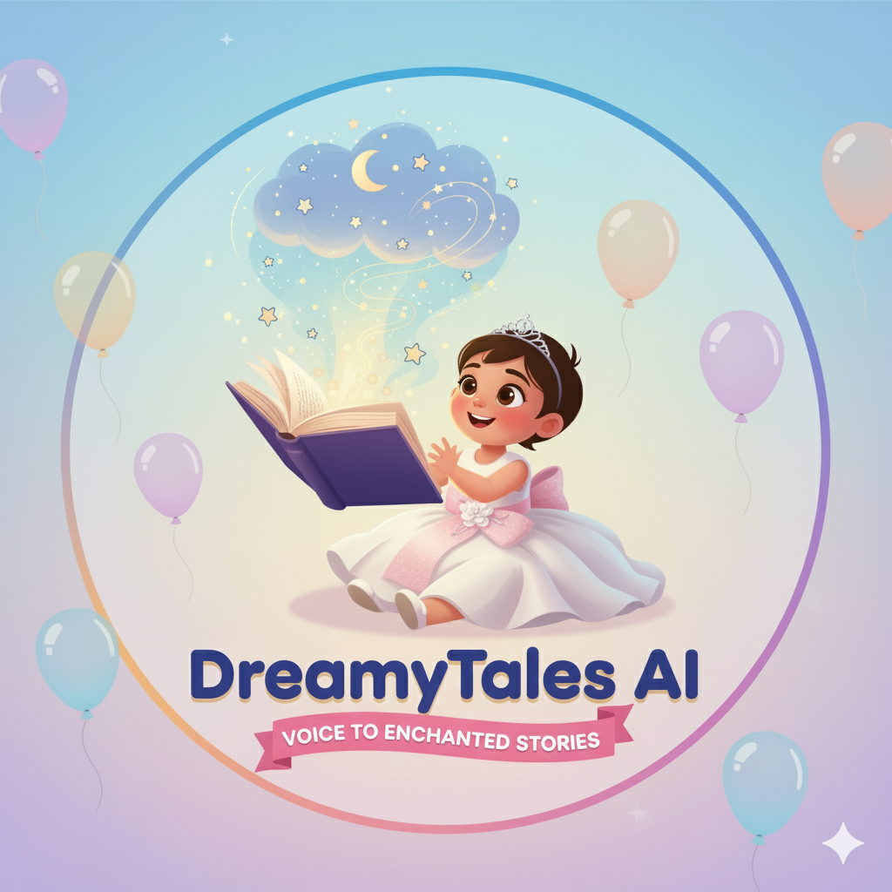

<p align="center">
  
</p>

# DreamyTales AI ✨

**AI Powered Fairy Tales Weaver**

[](https://www.youtube.com/placeholder-demo-url)
[](https://dreamytalesai.netlify.app/)

---

DreamyTales AI is a magical web application that transforms children's voice commands into beautifully narrated fairy tales. Powered by advanced AI, it sparks creativity and turns storytelling into an interactive, enchanting experience.
**Generative AI:** The "storyteller", Gemini model generates a completely new, original fairy tale.

**Voice AI:** The "ears and mouth", It includes two key functions:

**Speech-to-Text:** It listens to the child's voice command and converts it into text that the Generative AI can understand.

**Text-to-Speech:** After the story is written, it takes that text and turns it into spoken audio for the child to listen to.

**Conversational AI:** This describes the overall experience. The user interacts with the application in a conversational way—by speaking to it and getting a response (the story and narration). It's an AI designed for natural human interaction.

---

## 🌟 Features

- **Voice-to-Story (Speech-to-Text)**: Click the microphone, describe your story, and watch the magic happen.
- **AI-Powered Tales**: Leverages the Google Gemini API to generate unique, age-appropriate fairy tales on any topic.
- **Text-to-Speech Narration**: Click "Read Aloud" to have your story narrated with a gentle, friendly voice.
- **Fully Responsive**: Beautiful on desktops, tablets, and mobile phones.
- **Secure & Serverless**: The API key is never exposed; built to scale effortlessly.

---

## 🔗 Live App

👉 [https://dreamytalesai.netlify.app/](https://dreamytalesai.netlify.app/)

---

## 📺 Demo

[](https://www.youtube.com/watch?v=4fgu0A5EHz4)  

_Click the image above to watch the demo on YouTube._

---

## 🏗️ Architecture

DreamyTales AI uses a modern, serverless architecture for a seamless and secure experience:

```
User (Browser)
   │
   ▼
Frontend (HTML, Tailwind CSS, JavaScript)
   │
   ▼
Netlify Function (Serverless backend)
   │
   ▼
Google Gemini API (Story & TTS)
```

**Architecture Details**:

- **Frontend (Client-Side)**:  
  - Static HTML, Tailwind CSS, and vanilla JavaScript.
  - Handles voice input, user interaction, and story display.

- **Hosting (Netlify)**:  
  - The UI is deployed as a static site, globally distributed for speed and reliability.

- **Serverless Function (Netlify Functions)**:  
  - Handles requests for story generation and narration.
  - Securely stores the Google Gemini API key as an environment variable.
  - Keeps the API key hidden from the client/browser.

- **Google Gemini API**:  
  - For story generation: uses `gemini-2.5-flash-preview-05-20`.
  - For narration (text-to-speech): uses `gemini-2.5-flash-preview-tts`.

- **Flow**:
  1. User interacts with the web UI (voice or text).
  2. Frontend sends a request to the Netlify serverless function.
  3. The function contacts the Google Gemini API (with the secure key).
  4. The response (story or narration audio) is sent back to the frontend for display/playback.

---

## 🚀 Getting Started

1. **Clone the repository:**
   ```bash
   git clone https://github.com/siddth09/dreamytales-ai.git
   ```

2. **Get a Google Gemini API Key:**
   - Go to [Google AI Studio](https://aistudio.google.com/).
   - Sign in and click "Get API key" to generate one.

3. **Deploy on Netlify:**
   - Create a free Netlify account.
   - Link your GitHub repo.
   - Go to Site settings > Environment variables and add:
     - Key: `GEMINI_API_KEY`
     - Value: _(your Google Gemini API key)_

4. **Launch!**
   - Netlify auto-deploys your site.
   - Every push to GitHub triggers a new deployment.

---

## 🛠️ Technologies Used

- **Frontend:** HTML, Tailwind CSS, Vanilla JavaScript
- **Hosting & Backend:** Netlify, Netlify Functions (Serverless)
- **AI & ML:** Google Gemini API (story and TTS models)

---

## 📄 License

This project is licensed under the MIT License.
